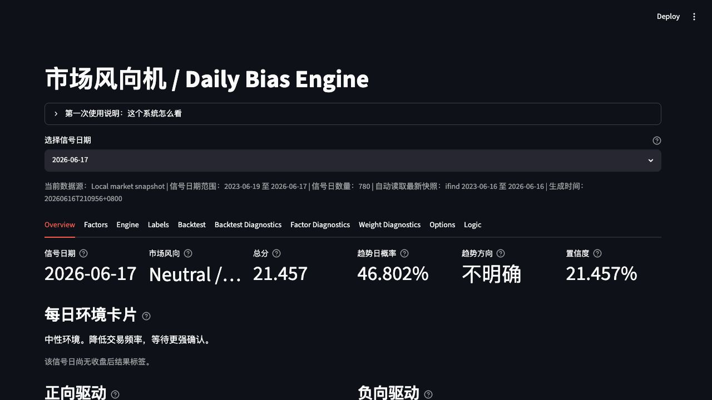
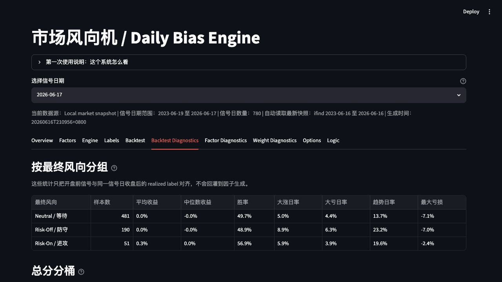
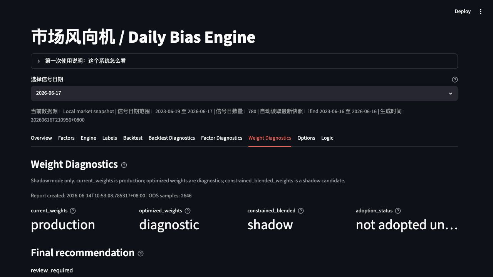
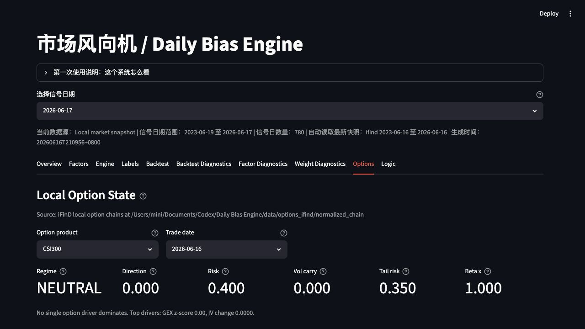

# Daily Bias Engine

Daily Bias Engine 是一个面向 A 股指数环境判断的盘前市场风向系统。它把本地化的 iFinD 行情、利率、ETF、期货、海外市场和期权链数据整理成可审计的因子，再输出 `Risk-On / Neutral / Risk-Off` 市场偏向、趋势日概率、风险硬标记和回测诊断。

项目定位不是自动交易系统，而是一个研究型市场环境过滤器。它适合放在个人页面或项目作品集中展示：数据工程、因子工程、规则引擎、回测评估、期权结构分析和 Streamlit 产品化界面。

## Highlights

- Snapshot-first 数据流：先在本地拉取并固化 iFinD 快照，再由 pipeline 和 Streamlit 读取 Parquet 结果。
- 盘前防偷看设计：日收盘数据生成下一交易日信号，因子同时保留 `data_date` 和信号 `date`。
- 可解释规则引擎：总分采用 `-100` 到 `+100` 区间，并展示正向驱动、负向驱动和风险覆盖原因。
- 期权结构模块：支持本地期权链的 GEX、Vanna、Charm、IV term structure、skew 和 beta overlay 诊断。
- 研究诊断闭环：包含 backtest、factor diagnostics、score bucket、trend bucket 和权重优化 shadow report。
- Streamlit dashboard：面向日常复盘和项目展示的交互式界面。

## Streamlit Gallery

### Overview



### Backtest Diagnostics



### Weight Diagnostics



### Options



## What The Dashboard Shows

`apps/streamlit_app.py` 是项目的主要展示入口。当前页面包含：

- Overview：最新信号、市场风向、总分、趋势日概率、置信度和驱动拆解。
- Factors：当前信号日使用的因子明细和全历史因子表。
- Engine：每日信号总览、分项分、风险硬标记和全部因子贡献。
- Labels：收盘后 realized label，用于评估盘前信号。
- Backtest：方向命中率、趋势日识别、大亏日过滤和逐日复盘。
- Backtest Diagnostics：按风向、总分分桶和趋势概率分桶检查历史表现。
- Factor Diagnostics：逐因子检验方向收益关系、亏损识别能力和五分位表现。
- Weight Diagnostics：展示当前权重、优化权重和 constrained blended shadow 权重。
- Options：展示本地 iFinD 期权链衍生出的关键价位、敞口、波动率和偏度结构。
- Logic：说明因子到 directional score、总分和最终 bias 的计算逻辑。

## Architecture

```text
data/snapshots/         local iFinD market snapshots
data/options_ifind/     local iFinD option-chain snapshots
configs/                instruments, thresholds, factor weights
src/daily_bias_engine/
  data/                 data clients, snapshot cache, iFinD adapters
  features/             factor calculators and as-of logic
  engine/               rule-based Daily Bias Engine
  labeling/             realized market labels
  backtest/             metrics and diagnostics
  options/              option analytics, reports and backtests
  report/               summary helpers
apps/                   Streamlit dashboard
reports/                weight optimizer diagnostics
tests/                  pytest coverage
```

## Install

```bash
python -m pip install -e ".[test]"
```

If your shell only has Python 3 under `python3`, use:

```bash
python3 -m pip install -e ".[test]"
```

## Run Streamlit Dashboard

```bash
python -m streamlit run apps/streamlit_app.py
```

The dashboard automatically loads the latest local market snapshot under `data/snapshots/`. If no snapshot exists, fetch or place an iFinD snapshot first.

## Run Tests

```bash
pytest
```

## Fetch iFinD Market Snapshot

Set `IFIND_USERNAME` and `IFIND_PASSWORD` in your local shell, then run:

```bash
python scripts/fetch_ifind_snapshot.py
```

By default this is incremental. If a local iFinD snapshot already exists, the script fetches only dates after the latest raw market date, merges them with the existing history, and writes a new full snapshot under `data/snapshots/`.

Force a full rebuild when needed:

```bash
python scripts/fetch_ifind_snapshot.py --full-refresh --years 3
```

## Fetch iFinD Option Snapshot

```bash
python scripts/fetch_ifind_options_snapshot.py --date 2026-06-12
python -m daily_bias_engine.options.reports.daily_option_state --date 2026-06-12 --product CSI300 --data-root data/options_ifind
```

The options tab reads local iFinD option chains under `data/options_ifind/`.

## Local Daily Updates

The project does not fetch iFinD data from GitHub Actions. Run the update from a local machine that has the iFinD terminal/API environment and can import `iFinDPy`.

```bash
python scripts/update_ifind_data.py
```

This updates main market snapshots incrementally, updates option chains by product/date, and keeps the latest two iFinD market snapshots. Streamlit Cloud does not call iFinD directly; to refresh a deployed app, commit and push the updated Parquet data under `data/snapshots/` and `data/options_ifind/`.

## Weight Diagnostics

Generate a walk-forward factor weight diagnostic report without changing `configs/factor_weights.yaml`:

```bash
python -m daily_bias_engine.weight_optimizer --snapshot-root data/snapshots --config-dir configs --output-dir reports/weight_optimizer
```

The report writes fixed latest files for dashboard consumption:

- `reports/weight_optimizer/latest_weight_diagnostics.json`
- `reports/weight_optimizer/latest_weight_diagnostics.md`
- `reports/weight_optimizer/walk_forward_folds.csv`
- `reports/weight_optimizer/factor_stability.csv`
- `reports/weight_optimizer/bucket_analysis_return.csv`
- `reports/weight_optimizer/bucket_analysis_risk.csv`
- `reports/weight_optimizer/regime_factor_ic.csv`

## Documentation

- [USER_MANUAL.md](USER_MANUAL.md): Chinese user guide.
- [DATA_DICTIONARY.md](DATA_DICTIONARY.md): Dataset and field notes.
- [FACTOR_LOGIC.md](FACTOR_LOGIC.md): Factor construction logic.
- [SCORING_RULES.md](SCORING_RULES.md): Scoring and threshold details.
- [SPEC.md](SPEC.md): Project specification.

## Current Scope

- Implemented: iFinD data fetching, Parquet cache, representative factors, score engine, labels, metrics, tests, Streamlit dashboard, option state layer and weight diagnostics.
- Not implemented yet: scheduler, database storage, execution integration or live broker connection.

## Disclaimer

This repository is for research and project demonstration only. The output is a market-environment signal, not investment advice or an order-generation system.
